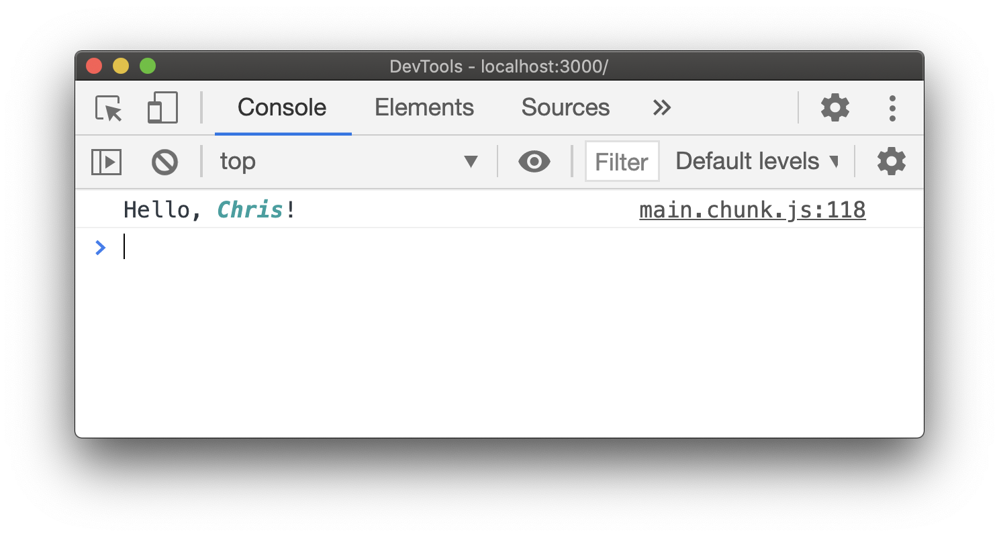
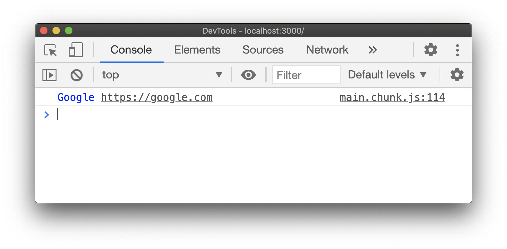
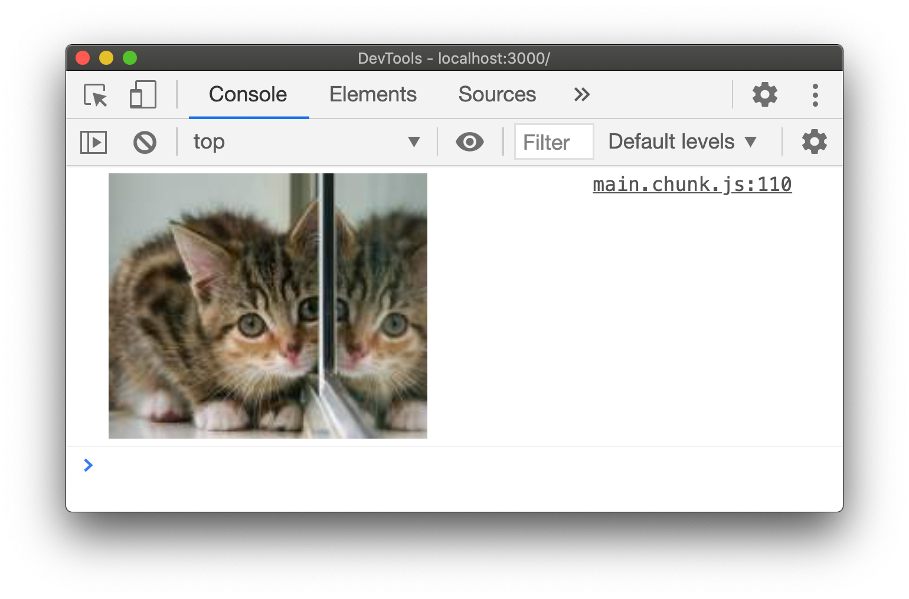
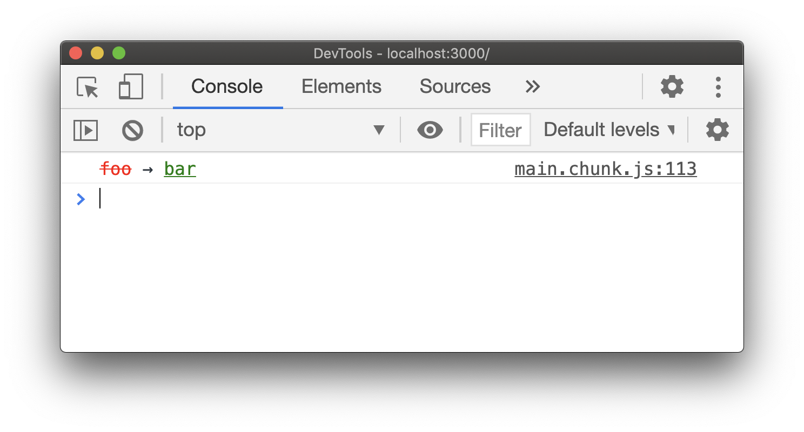
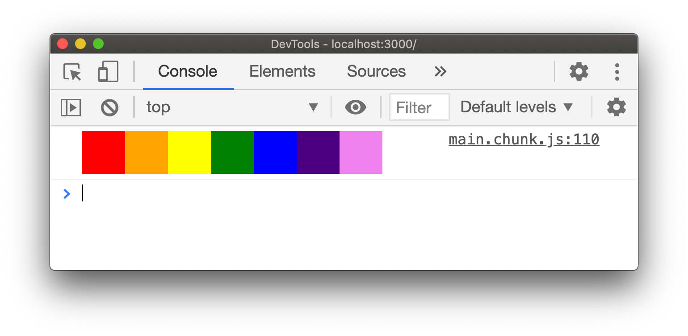

# React Console

A reconciler for rendering components to the browser's console, because why not.

```jsx
import React from "react";
import console from "react-console";

const name = "Chris";
const color = "#21a0a0";

console.log(
  <div>
    Hello,{" "}
    <strong>
      <em style={{ color }}>{name}</em>
    </strong>
    !
  </div>
);
```



## Usage

### Install

Add `react-console` as a dependency to your project.

```
npm install react-console
```

### Console

`react-console` exports a console context with an additional `render` method.
This can be used as a replacement to the global `console` object, however it
allows rendering of React components.

#### Methods

The following methods will render a component if the **_first and only_**
argument is a React element.

- `.log`
- `.info`
- `.debug`
- `.warn`
- `.error`
- `.group`
- `.groupCollapsed`
- `.trace`

#### Render

The methods above are just sugar for the `render` method.

```jsx
import React from "react";
import console from "react-console";

console.render(<span>Ouch</span>, window.console, "error");
// same as
console.error(<span>Ouch</span>);
```

#### Anchors

Anchor elements will have their hrefs appended.

```js
import React from "react";
import console from "react-console";

console.log(<a href="https://google.com">Google</a>);
```



#### Images

You can render images however you must provide `width` and `height` props.

```jsx
import React from "react";
import console from "react-console";

console.log(
  
);
```



### User Components

You can render any user defined component as long as they result to host
components that are supported.

```jsx
import React from "react";
import console from "react-console";

function Diff(props) {
  return (
    <>
      <del style={{ color: "red" }}>{props.previous}</del>
      <span> → </span>
      <ins style={{ color: "green" }}>{props.next}</ins>
    </>
  );
}

console.log(<Diff previous="foo" next="bar" />);
```



### Caveats

#### One-time log

Logs are a one-time render, meaning components can't cause console logs.
Therefore use of hooks will not work. Nor will self updating components via
component lifecycles.

#### Logging elements

To log the element object itself instead of rendering you can do this:

```jsx
console.log("%o", <Foo />);
// or
window.console.log(<Foo />);
```

#### No block or layout elements

The console will only create `spans` for substitutions and removes any block
styling. Trying to style complex layouts in the console won't work.

However, you can try create block-like logs with a little padding trick.

```jsx
import React from "react";
import console from "react-console";

function ColorBlock(props) {
  return (
    <div
      style={{
        // use left/top paddings as if they were width/height
        paddingLeft: "32px",
        paddingTop: "32px",
        // set the font size to zero
        fontSize: 0,
        backgroundColor: props.color,
      }}
    >
      {/* render an empty string */}{" "}
    </div>
  );
}

console.log(
  <>
    <ColorBlock color="red" />
    <ColorBlock color="orange" />
    <ColorBlock color="yellow" />
    <ColorBlock color="green" />
    <ColorBlock color="blue" />
    <ColorBlock color="indigo" />
    <ColorBlock color="violet" />
  </>
);
```


